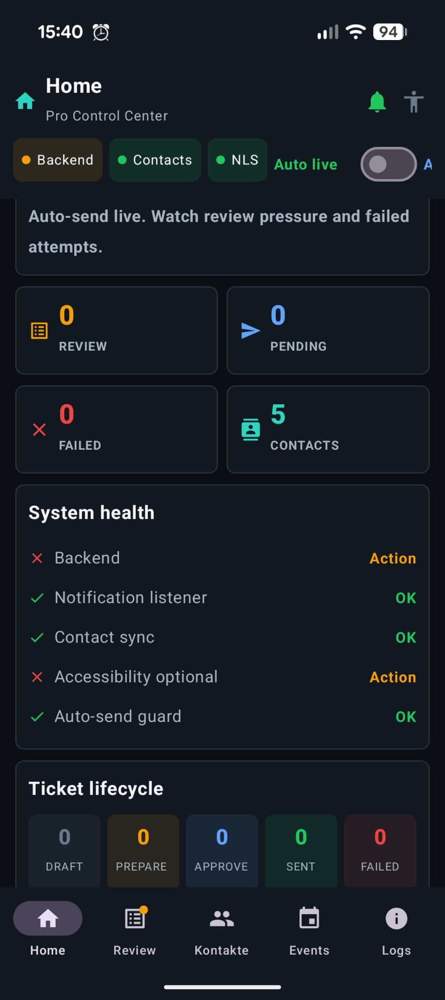
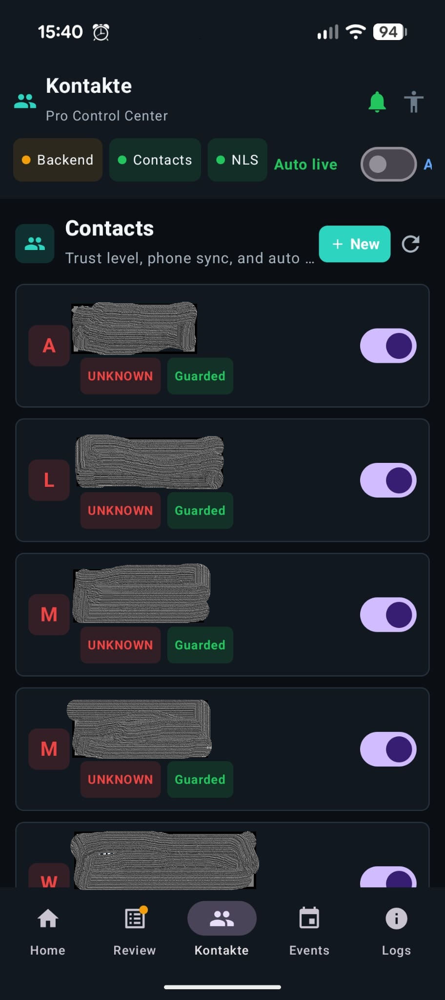
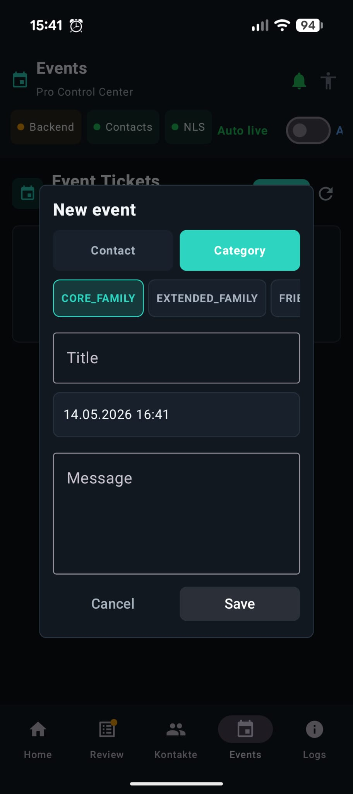
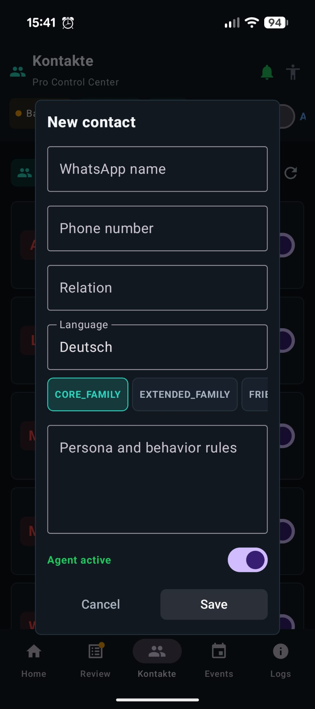
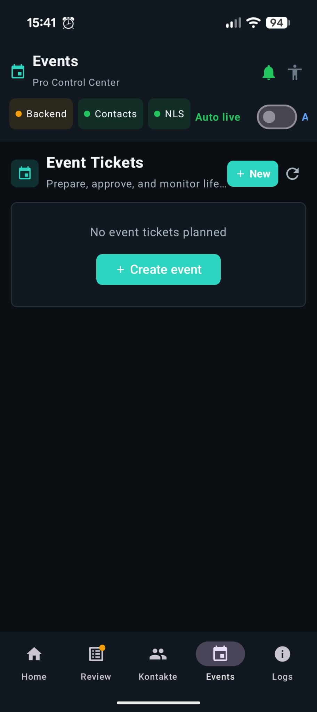
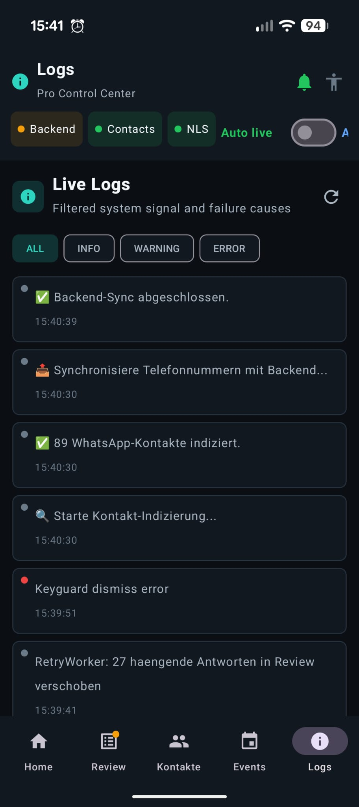
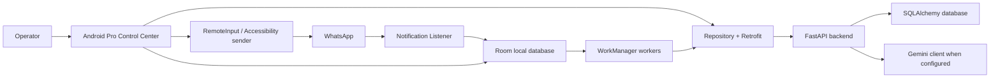

# WA Agent Pro Control Center


WA Agent Pro Control Center is an Android-first control center for a personal WhatsApp automation agent. The long-term idea is ambitious: an agent that can understand private messages, remember context, adapt to the relationship with the sender, write in the owner's personal style, and eventually answer across text and voice.

Today, the project is a working prototype foundation: Android captures WhatsApp notifications, stores and syncs messages, a FastAPI backend creates decisions and drafts, and the app gives the operator a serious Review Queue, contact rules, notes, event tickets, logs, and safety controls.

This repository is not just a chat bot experiment. It is a step-by-step attempt to build a controllable personal communication agent.

> Disclaimer: this is an independent research/prototype project. It is not affiliated with, endorsed by, or officially supported by WhatsApp, Meta, Google, Gemini, ElevenLabs, or any other platform provider. Android notification, RemoteInput, and Accessibility behavior can change by device, OS version, app version, and policy.

## Screenshots

The current UI is a dense, phone-first control center. Contact names in screenshots may be redacted.

| Dashboard | Contacts | Event form |
| --- | --- | --- |
|  |  |  |

| Contact form | Events empty state | Logs |
| --- | --- | --- |
|  |  |  |

## Motivation

The original motivation was to build a fully autonomous WhatsApp agent that can reply to private messages in a way that feels natural and personal:

- detect and filter WhatsApp and WhatsApp Business messages;
- identify the sender and react differently for family, work, friends, and unknown contacts;
- understand and remember conversation context;
- generate replies in a personal style, including English, German, and Syrian Arabic;
- use realistic behavior such as delays, small imperfections, and a recognizable personal voice;
- reply automatically when allowed, ideally even when the screen is locked;
- later understand voice messages, transcribe them, answer them, and send voice replies.

The project now treats this vision with a control-center mindset: autonomy should be earned through policy, trust, review, audit, and visible safety state. The agent should not blindly send everything. It should know when to answer, when to ask for review, and when to stay silent.

## Long-Term Vision

The long-term target is a personal agent that can handle WhatsApp, Telegram, and email, backed by a learning personality model and a priority system:

- important messages are answered quickly;
- low-priority messages can wait or be ignored;
- sensitive topics go to review;
- each contact can have its own tone, language, delay, and safety rules;
- text replies and voice replies become part of the same decision pipeline.

Voice is part of the future plan:

1. collect 10 to 30 minutes of the owner's voice recordings;
2. use a TTS provider such as ElevenLabs to generate speech in that voice;
3. convert backend output to WhatsApp-compatible `.ogg` Opus audio;
4. let Android send the generated audio through an approved share/send flow.

The professional product path is different from the personal Android prototype. For real users and production reliability, the preferred long-term channel is the official WhatsApp Business Platform / Cloud API. The Android automation path is useful for a personal companion, but it remains best-effort and device-dependent.

See [VISION.md](VISION.md) for the planning roadmap.

## Roadmap

The next work is tracked in [VISION.md](VISION.md). Current priority themes:

- stabilize Android notification capture, RemoteInput sending, retry, and failure reporting;
- strengthen policy and review gates before increasing autonomy;
- improve contact personality, notes, language, and memory behavior;
- prototype voice-message transcription and reviewed voice replies;
- make event tickets and scheduled communication more reliable;
- prepare a future channel abstraction for WhatsApp Cloud API, Telegram, and email.

## What We Have Achieved So Far

- Consolidated the FastAPI backend under `backend/`.
- Added token-protected backend routes for inbound messages, contacts, notes, queue, event tickets, send attempts, stats, and health.
- Built a SQLAlchemy domain model with contacts, categories, rules, messages, drafts, send attempts, notes, event tickets, event recipients, legacy events, and audit logs.
- Added a migration/seed script for local development data.
- Added Android Room entities for queue/cache data, contacts, notes, events, event tickets, recipients, and send attempts.
- Added Retrofit API integration through `AgentApiService` and repository wiring.
- Implemented Android notification capture through `WhatsAppListener`.
- Kept RemoteInput as the preferred send path and Accessibility as a fallback path.
- Added WorkManager flows for sync, retry, event-recipient polling, and contact indexing.
- Reworked the Android UI into a phone-first Pro Control Center.
- Restored missing modules in the new UI: event creation form, contact detail/form, and notes management.
- Improved the Review Queue UI with an editable review form, approve/block actions, risk/category/status signals, and failure state.
- Added architecture diagrams in Mermaid and mirrored them into a FigJam board.
- Added documentation for architecture, backend integration, manual testing, UI redesign, and project direction.

## What It Does Now

- Captures WhatsApp and WhatsApp Business notifications through Android `NotificationListenerService`.
- Parses inbound messages, stores them locally in Room, and syncs them to the backend.
- Uses backend policy and optional Gemini generation to create draft replies.
- Routes risky or paused replies into a Review Queue before sending.
- Supports direct approval/blocking with editable draft text and failure reasons.
- Sends approved inbound drafts through Android RemoteInput when a valid `custom_id` exists.
- Uses Accessibility as an optional fallback when RemoteInput is not available.
- Manages contacts, categories, relationship rules, language, active state, and auto mode.
- Adds contact-scoped notes that can be pinned, expired, and used as prompt context.
- Creates event tickets for single contacts or category broadcasts, then prepares recipient drafts.
- Tracks send attempts, retry state, backend health, logs, and operational safety status.

## Current Product Shape

The Android app is designed as a phone-first Pro Control Center:

- `Dashboard`: backend health, permissions, queue pressure, failed sends, newest risks.
- `Review`: primary decision surface for draft replies.
- `Contacts`: compact control list with contact detail, edit/delete, active toggle, and notes.
- `Events`: ticket lifecycle view with event creation and recipient send state.
- `Logs`: dense operational log stream with failure signals.

The Compose UI is split into reusable pro modules:

- `app/src/main/java/com/example/whatsappagent/MainActivity.kt`
- `app/src/main/java/com/example/whatsappagent/ui/pro/ProTokens.kt`
- `app/src/main/java/com/example/whatsappagent/ui/pro/ProComponents.kt`
- `app/src/main/java/com/example/whatsappagent/ui/pro/ProScreens.kt`

## Architecture



For detailed diagrams, see [docs/architecture_diagrams.md](docs/architecture_diagrams.md).

## Repository Layout

```text
.
|-- app/                         Android app, Jetpack Compose, Room, WorkManager
|-- backend/                     FastAPI backend, SQLAlchemy models, migration script
|-- docs/                        Architecture, project specs, test matrix, design notes
|-- gradle/                      Gradle wrapper support
|-- .env.example                 Shared local configuration template
|-- build.gradle.kts             Root Gradle config
|-- settings.gradle.kts          Android project settings
|-- README.md                    GitHub project overview
`-- VISION.md                    Product vision and next-step roadmap
```

Important Android areas:

- `WhatsAppListener.kt`: notification capture and RemoteInput send path.
- `AutoreplyService.kt`: Accessibility fallback sender.
- `worker/SyncWorker.kt`: inbound sync, queue polling, event-recipient polling.
- `worker/RetryReplyWorker.kt`: retry path for pending or failed replies.
- `worker/ContactIndexerWorker.kt`: local contacts indexing and sync.
- `data/`: Room entities, DAOs, Retrofit API client, repository.
- `ui/viewmodel/`: screen and feature ViewModels.

Important backend areas:

- `backend/main.py`: FastAPI routes and orchestration.
- `backend/database.py`: SQLAlchemy entities and enums.
- `backend/migrate.py`: schema reset and seed helper.
- `backend/tests/`: backend policy and migration tests.

## Core Flows

### Message Flow

1. WhatsApp posts a notification.
2. Android notification listener parses sender, phone, text, package, and notification key.
3. Message is stored in Room `messages_queue`.
4. `SyncWorker` posts the inbound message to `POST /messages/inbound`.
5. Backend resolves contact rules, notes, risk, and generation policy.
6. Draft becomes either auto-send allowed, review-required, blocked, or failed.
7. Review Queue allows editing, approving, blocking, or retrying.
8. Android sends approved inbound drafts only when a usable `custom_id` exists.
9. Send attempts are synced back to the backend.

### Event Ticket Flow

1. User creates an event for one contact or a category broadcast.
2. Backend creates an `EventTicket`.
3. Preparing a ticket creates `EventRecipient` and draft rows.
4. Approval marks eligible recipients for sending.
5. Android polls due event recipients and sends through the normal WhatsApp send path.
6. Ticket aggregate state shows prepared, approved, sending, sent, failed, or partial result.

### Contacts And Notes

Contacts are managed through backend endpoints and cached locally. Notes are scoped to contacts or categories, can be pinned or expired, and are included in backend prompt context when active.

## Backend API Overview

Most endpoints require:

```http
Authorization: Bearer <APP_API_TOKEN>
```

Core endpoints:

- `GET /health`
- `GET /stats`
- `POST /messages/inbound`
- `POST /generate`
- `GET|POST|PATCH|DELETE /contacts`
- `GET|POST|PATCH|DELETE /notes`
- `GET|POST|PATCH|DELETE /contacts/{contact_name}/notes`
- `GET /queue`
- `PATCH /drafts/{draft_id}/decision`
- `POST /drafts/{draft_id}/send-attempts`
- `PATCH /send-attempts/{attempt_id}`
- `GET|POST /event-tickets`
- `POST /event-tickets/{ticket_id}/prepare`
- `POST /event-tickets/{ticket_id}/approve`
- `POST /event-tickets/{ticket_id}/cancel`
- `GET /event-recipients/due`

## Prerequisites

- Android Studio with JDK 17.
- Android device or emulator with notification access support.
- Python 3.10+ recommended for the backend.
- A Gemini API key if AI draft generation should be enabled.
- Optional: ngrok or another HTTPS tunnel if the Android device cannot reach the local backend directly.

## Configuration

Copy the example environment file:

```powershell
Copy-Item .env.example .env
```

Set at least:

```env
GEMINI_API_KEY=your-key
APP_API_TOKEN=dev-token-change-me
DATABASE_URL=sqlite:///./whatsapp_agent.db
BACKEND_BASE_URL=http://10.0.2.2:8000
```

Notes:

- `APP_API_TOKEN` must match between Android and backend.
- `BACKEND_BASE_URL` is read by Gradle from `.env`, Gradle properties, or environment variables.
- For a physical Android device, use the LAN IP or tunnel URL instead of `10.0.2.2`.

## Running The Backend

From the repository root:

```powershell
python -m uvicorn backend.main:app --reload
```

Initialize or refresh seed data:

```powershell
python -m backend.migrate
```

Reset the local database and seed again:

```powershell
python -m backend.migrate --reset
```

Default local database path:

```text
whatsapp_agent.db
```

## Running The Android App

Build from the repository root:

```powershell
.\gradlew.bat :app:assembleDebug
```

In Android Studio, open the project root and run the `app` configuration.

On the device, enable the required access:

- Notification access for the WhatsApp listener.
- Notification permission on modern Android versions.
- Contacts permission if contact indexing is needed.
- Accessibility service only if the fallback sender is required.

## Tests And Checks

Android compile check:

```powershell
.\gradlew.bat :app:compileDebugKotlin
```

Android unit tests:

```powershell
.\gradlew.bat :app:testDebugUnitTest
```

Backend tests:

```powershell
python -m pytest backend/tests
```

Manual scenarios worth checking before a release:

- Backend offline, token mismatch, and failed Gemini generation.
- Empty Review Queue, many drafts, edited approve, block with reason, retry failure.
- Long contact names, inactive contacts, category broadcast, notes with expiry.
- RemoteInput unavailable and Accessibility fallback enabled.
- Event tickets with all sent, partial failure, and due-recipient polling.

## Design And Documentation

- [Product vision and roadmap](VISION.md)
- [Architecture diagrams](docs/architecture_diagrams.md)
- [UI redesign and Canva notes](docs/ui_redesign_canva.md)
- [Manual device test matrix](docs/manual_device_test_matrix.md)
- [Backend integration guide](docs/BACKEND_INTEGRATION_GUIDE.md)
- [Project deep dive](docs/project_specification_deep_dive.md)
- [Agent handbook](docs/agent_handbook.md)
- [Historical technical vision notes](docs/vision.md)
- [Contributing guide](CONTRIBUTING.md)
- [Security policy](SECURITY.md)

The current FigJam architecture board created from the Mermaid diagrams:

- [WA Agent Architecture FigJam](https://www.figma.com/board/SaQ0IA8zjQd0nSUBV2MnHu)

## Safety, Privacy, And Trust

This project handles private messaging data and can act in a user's personal communication space. Treat local databases, logs, screenshots, and exported diagrams as sensitive.

- Do not commit real `.env` secrets.
- Do not commit production message databases.
- Review generated replies before enabling auto-send behavior.
- Keep Accessibility fallback explicit and visible to the operator.
- Use a private backend deployment or secured tunnel for real devices.
- Do not use the system to impersonate someone in contexts where disclosure, consent, or legal compliance is required.

The product direction is controlled autonomy: the agent should become more capable over time, but the operator must always be able to see, pause, review, and override it.

## Suggested GitHub Topics

Use these topics in the GitHub repository About panel:

`android`, `jetpack-compose`, `fastapi`, `whatsapp`, `automation`, `ai-agent`, `personal-assistant`, `workmanager`, `room-database`, `notification-listener`, `android-accessibility`, `llm`, `gemini`, `python`, `kotlin`

## Development Status

This is an active prototype/control-center implementation. Backend contracts, Android ViewModels, Room cache entities, WorkManager flows, and the Compose Pro UI are present. Production hardening still needs careful review around deployment, data retention, auth, observability, WhatsApp policy, and device-specific send behavior.

## License

Licensed under the [Apache License 2.0](LICENSE).
