# WA Agent Pro Control Center Architecture Diagrams

This document is the durable source of truth for architecture diagrams. Canva is the presentation layer; Mermaid below is the maintainable version.

Sources checked:

- Backend data model: `backend/database.py`
- Backend API and orchestration: `backend/main.py`
- Android Room layer: `app/src/main/java/com/example/whatsappagent/data/*`
- Android API client: `app/src/main/java/com/example/whatsappagent/data/remote/AgentApiService.kt`
- Android services/workers: `WhatsAppListener.kt`, `AutoreplyService.kt`, `AgentService.kt`, `SyncWorker.kt`, `ContactIndexerWorker.kt`, `RetryReplyWorker.kt`
- Pro UI shell/screens: `MainActivity.kt`, `ui/pro/*`

## Backend Database ERM

Source of truth: SQLAlchemy models in `backend/database.py`.

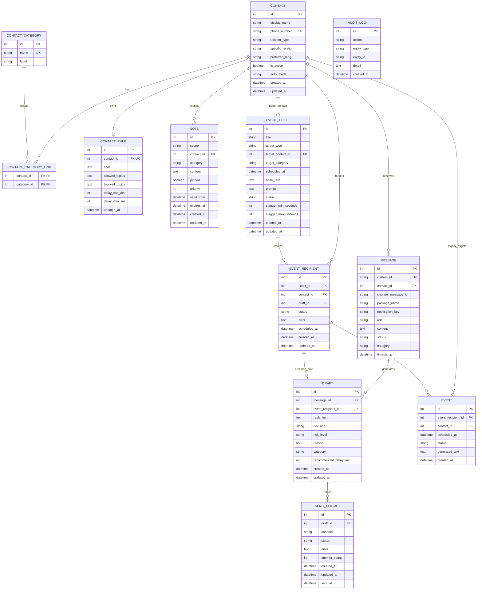

## Android Local Room ERM

Source of truth: Room entities in `app/src/main/java/com/example/whatsappagent/data`.

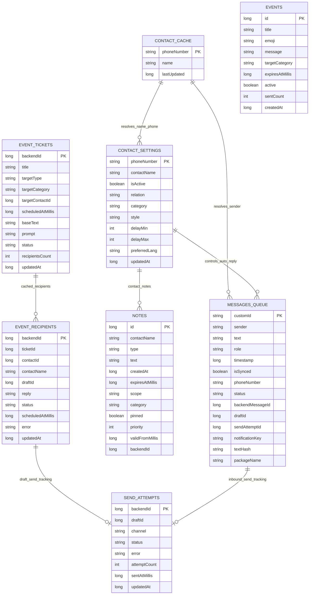

## Gesamt-App Context Diagram

Source of truth: Android app shell, services/workers, API client, backend API, WhatsApp send paths.

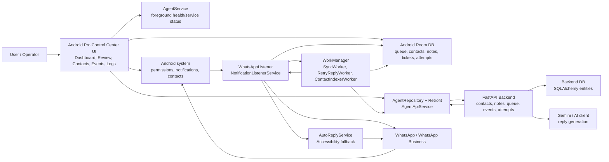

## Backend Context Diagram

Source of truth: FastAPI routes in `backend/main.py`.

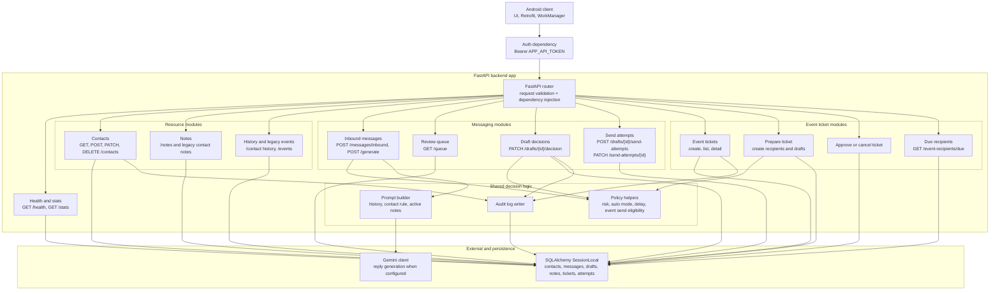

## End-to-End Message Flow

Source of truth: `WhatsAppListener.kt`, `SyncWorker.kt`, backend `/messages/inbound`, review queue update path.

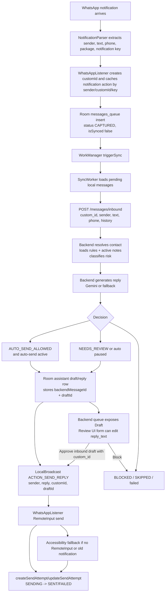

## Review Queue State Flow

Source of truth: backend draft decision endpoint, Android `QueueViewModel`, `ProQueue`.

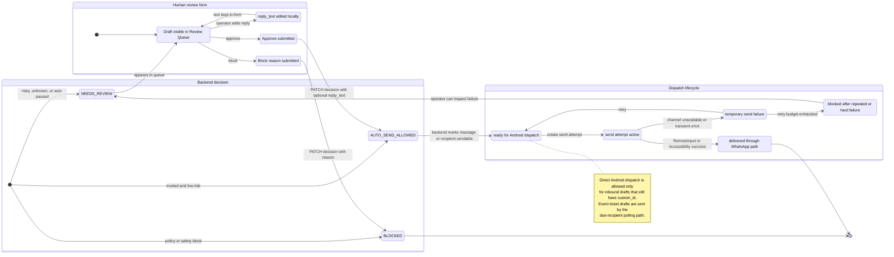

Review Queue dispatch gate, shown separately to make the production rule explicit:

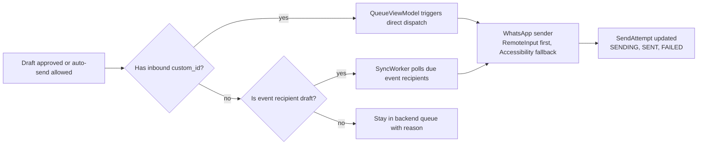

## Event Ticket Flow

Source of truth: `EventsViewModel`, `ProEvents`, backend event-ticket routes, `SyncWorker.pollDueEventRecipients`.

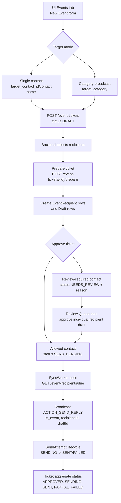

## Contact And Notes Flow

Source of truth: contacts endpoints, ContactIndexerWorker, ContactsViewModel, notes endpoints, prompt builder.

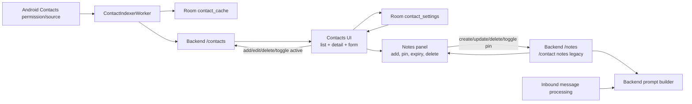

## UI Navigation And Screen Flow

Source of truth: `MainActivity.kt`, `ui/pro/ProComponents.kt`, `ui/pro/ProScreens.kt`.

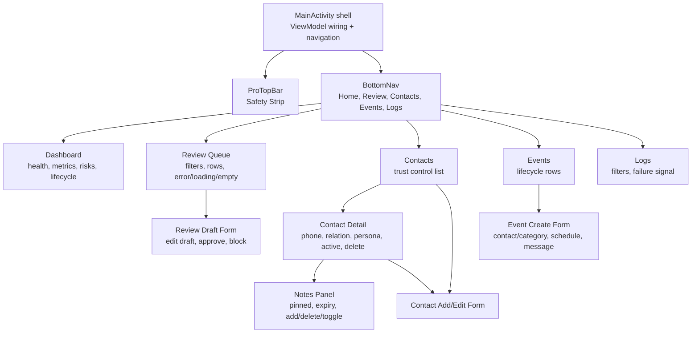

## Android Worker And Service Flow

Source of truth: Android services and workers.

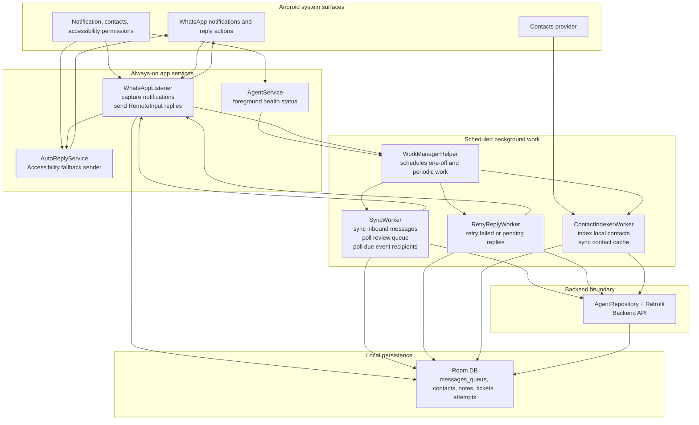

## API Surface Map

Source of truth: `AgentApiService.kt` and route handlers in `backend/main.py`.

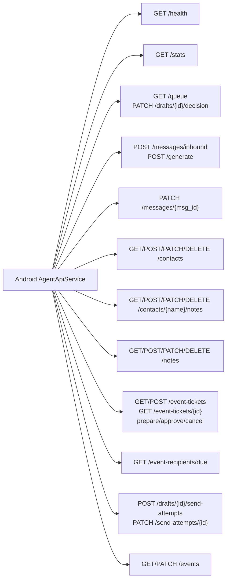

## Canva Presentation Mapping

The current Canva board `DAHJj94e05M` is a responsive single-page design-system board. The available Canva edit operations can replace existing text, but they cannot add the requested new diagram pages to that existing board in this session.

Recommended Canva page structure when page insertion or a presentation workflow is available:

1. Design System Blueprint
2. Backend Database ERM
3. Android Room ERM
4. Gesamt-App Context
5. Backend Context
6. End-to-End Message Flow
7. Review Queue State Flow
8. Event Ticket Flow
9. Contact and Notes Flow
10. UI Navigation and Screen Flow
11. Android Worker and Service Flow
12. API Surface Map

Use this Markdown document as source material for the Canva diagrams. The Canva version should simplify fields and keep only relationships, modules, and lifecycle states needed for presentation.
