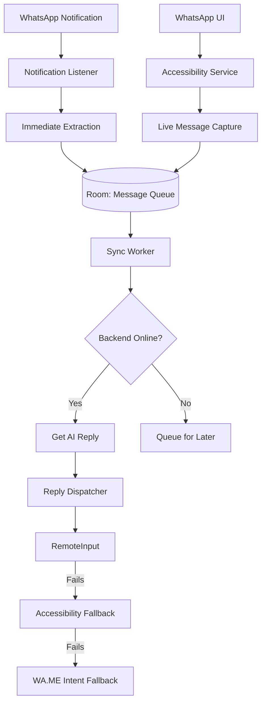

# Implementation Plan: Reliable WhatsApp Integration

This plan addresses the current `SBN null` errors and implements a robust, multi-layered message handling system.

## 1. High-Level Architecture

## 2. Component Breakdown

### A. Data Layer (`AppDatabase`)
- **`MessageQueueTable`**: Added fields: `phoneNumber`, `replyPendingIntent`, `openPendingIntent`, `retryCount`, `status` (CAPTURED, SYNCED, REPLYING, DONE, FAILED).
- **`ContactCacheTable`**: Local mapping of `WhatsApp Name` -> `Phone Number` (filled via `ContactsContract`).

### B. Service Layer
- **`WhatsAppListener` (NLS)**:
    - On `onNotificationPosted`: Immediately extract JID/Phone number from extras (if available) or trigger a contact lookup.
    - Cache the `Action.reply` object's `PendingIntent` and `RemoteInput` keys.
- **`AutoReplyService` (AS)**:
    - Add logic to detect "current chat" and scrape new messages appearing on screen (for when WhatsApp is open).
    - Implement `findAndType(text)` and `clickSend()` as the ultimate fallback.

### C. Logic Layer (`ReplyDispatcher`)
- Logic to decide which method to use:
    1. Try `RemoteInput` (if notification still active).
    2. Try `AccessibilityService` (direct UI interaction).
    3. Try `wa.me` intent + `AccessibilityService` (open chat then type/send).

## 3. Implementation Steps

### Phase 1: Fixing existing errors
1. Create `NotificationData` data class to store extracted metadata.
2. Update `WhatsAppListener` to extract and store this data immediately.
3. Modify `fallbackOpenChat` to use `phoneNumber` + `wa.me` URI if the SBN is missing.

### Phase 2: Reliability & Offline Safety
1. Implement `READ_CONTACTS` permission handling.
2. Create a background task to index WhatsApp contacts (Name -> Number).
3. Update `SyncWorker` to perform exponential backoff on network failure.

### Phase 3: Accessibility Enhancements
1. Update `AutoReplyService` to handle "Message Scraper" mode.
2. Add "Search and Open Chat" capability to AS.

## 4. Testing Strategy
- **Simulation**: Clear a notification manually while the agent is in the "Warte Xs" phase. Verify it still replies using the fallback.
- **Offline Test**: Disable Wi-Fi/Data. Send message. Verify it stays in Room and syncs automatically when internet returns.
- **Foreground Test**: Open WhatsApp chat. Verify the agent captures the incoming message via AS (since NLS won't trigger).
